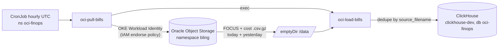

# oci-costing

Download OCI cost report CSV files and load them into ClickHouse (and/or PostgreSQL).

Runs in production as an hourly Kubernetes CronJob on OKE cluster `develop-aiplat`
(namespace `oci-finops`), loading ClickHouse db `oci-finops`. See **How it works** below
and `docs/deployment.md` for the full deployment runbook.

Two binaries built from this repo:

| Binary | Role |
|---|---|
| `oci-load-bills` | Loader CLI. Reads `.csv.gz` files, writes ClickHouse and/or Postgres (`WRITE_CH`/`WRITE_PG`). |
| `oci-pull-bills` | Orchestrator. Downloads reports from OCI Object Storage (in-process), then invokes `oci-load-bills`. Container entrypoint. |

Two report formats supported by the loader:

- **FOCUS** — OCI FOCUS cost reports (FinOps Open Cost & Usage Specification) → `focus_data_table`
- **OCI proprietary** — `cost-csv/...` reports → `oci_cost_report`

## How it works



1. CronJob fires hourly; pod authenticates to OCI via **Workload Identity** (no stored keys —
   a root-tenancy IAM policy endorses exactly this cluster + namespace + ServiceAccount).
2. `oci-pull-bills` downloads FOCUS + proprietary cost CSVs for **today + yesterday** from
   Oracle's reporting bucket into an ephemeral volume.
3. It then execs `oci-load-bills` per report type, which parses and inserts into ClickHouse.
4. Every file dedupes by `source_filename`, so hourly re-runs no-op on already-loaded files
   and missed runs self-heal on the next tick.

## Prerequisites

- Go 1.26+
- ClickHouse with the target tables created (see `oci-dbs/clickhouse/`) — and/or PostgreSQL (`oci-dbs/postgresql/`) if `WRITE_PG=true`
- **For OCI Object Storage access** — auth depends on where you run:
  - **Production (OKE):** set `OCI_AUTH=workload_identity`. A root-tenancy IAM policy endorses the pod's cluster+namespace+ServiceAccount tuple. No `~/.oci/config` needed. See `docs/deployment.md`.
  - **Local dev:** `~/.oci/config` with a profile that has READ on the reporting bucket. The loader auto-detects this when `OCI_AUTH` is unset.

## Setup

```bash
cp .env.example .env
# fill values
```

Connection config: set **either** `DATABASE_URL` (preferred — single Postgres URI) **or** the legacy `DB_*` set. `DATABASE_URL` wins if both are present.

| Variable | Required | Description |
|---|---|---|
| `DATABASE_URL` | preferred | Full Postgres URI, e.g. `postgres://user:pw@host:5432/ocianalytics?sslmode=verify-full&sslrootcert=./dbsystem.pub`. Password must be URL-encoded. |
| `DB_USER` | fallback | PostgreSQL username (ignored if `DATABASE_URL` set) |
| `DB_PASSWORD` | fallback | PostgreSQL password |
| `DB_HOST` | fallback | OCI PostgreSQL host FQDN |
| `DB_PORT` | fallback | Port (default `5432`) |
| `DB_NAME` | fallback | Database name (default `ocianalytics`) |
| `DB_SSLROOTCERT` | fallback | Path to SSL root cert (default `./dbsystem.pub`) |
| `OCI_AUTH` | no | Force a specific OCI auth method: `workload_identity` (prod / OKE), `resource_principal`, `instance_principal`, `api_key`, or `auto`/unset for chain |
| `OCI_PROFILE` | local only | Profile in `~/.oci/config` — used only when the api-key path runs (`OCI_AUTH=api_key` or auto-chain falls through to it). Ignored under Workload Identity. Default `DEFAULT`. |
| `OCI_DATA_DIR` | no | Working dir for downloaded CSVs (default `./data` locally, `/data` in container) |
| `TAGS_CONFIG` | no | Path to `tags.yaml` (default: next to the binary, i.e. `src/tags.yaml` for local builds; ConfigMap-mounted in k8s) |
| `WRITE_PG` | no | Enable Postgres sink (default `true`) |
| `WRITE_CH` | no | Enable ClickHouse sink (default `false`) |
| `CLICKHOUSE_URL` | required if `WRITE_CH=true` | CH DSN. Scheme must match port: `http://user:pw@host:8123/oci-finops` (HTTP — what prod uses) or `clickhouse://user:pw@host:9000/...` (native). Mismatch → handshake error. |

In Kubernetes the loader receives `CLICKHOUSE_URL` from Secret `oci-costing-secret` (key `clickhouse_url`) with `WRITE_CH=true`, `WRITE_PG=false`. See `docs/deployment.md`.

## Build

```bash
cd src
go build -o oci-load-bills ./cmd/oci-load-bills
go build -o oci-pull-bills ./cmd/oci-pull-bills
```

## Usage

### Loader (`oci-load-bills`)

```bash
oci-load-bills focus <file.csv.gz|folder>   # FOCUS reports
oci-load-bills oci   <file.csv.gz|folder>   # OCI proprietary reports
```

Exit codes: `0` = all loaded/skipped, `2` = partial failure (some files failed but batch continued), `1` = setup error.

### Orchestrator (`oci-pull-bills`)

```bash
oci-pull-bills            # yesterday + today (UTC)
oci-pull-bills 2026-04-01 # specific date
oci-pull-bills 2026-04    # entire month
```

Steps: downloads FOCUS + cost CSVs for the requested interval(s) into `$OCI_DATA_DIR/{focus,cost}/`, then runs `oci-load-bills focus` and `oci-load-bills oci` over those dirs. Loaders are idempotent — files dedupe by `source_filename`.

## Loader details

### FOCUS

Loads into `focus_data_table`. CSV headers map 1:1 to DB columns. `Tags` JSON column is merged with extras from `tags/*` columns listed in `tags.yaml`. If the CSV omits a `Tags` column, one is synthesized from `tags/*` extras.

### OCI proprietary

Loads into `oci_cost_report`. Fixed columns map by header. *All* `tags/*` columns are dynamically detected and rolled into a single JSONB `tags` column. Correction rows (`lineItem/isCorrection`) are stored as-is; use the `oci_cost_report_effective` view for corrected data.

## ClickHouse dual-write

The loader can write each file to Postgres, ClickHouse, or both, controlled by `WRITE_PG`/`WRITE_CH`:

| Phase | `WRITE_PG` | `WRITE_CH` | Notes |
|---|---|---|---|
| 1 — CH validation | `true` | `true` | Dual-write; PG stays source of truth. |
| 2 — dual-write bake | `true` | `true` | Run until diffs match (see migration plan §7), then flip. |
| 3 — CH cutover | `false` | `true` | PG sink disabled once CH is trusted. **← current production state (since 2026-07-11)** |

Semantics are **strict AND**: a file is only `DONE`/archived if *every enabled* sink succeeds; if any enabled sink fails, the file `FAIL`s, is not archived, and the process exits `2`. Each sink dedupes independently by `source_filename`, so a retry only re-runs the sink(s) that failed — no cross-DB transaction needed.

See `docs/clickhouse-migration-plan.md` for the full design and `oci-dbs/clickhouse/README.md` for schema/DDL notes.

## Features

- `.csv.gz` (gzipped) inputs
- Batch `COPY` writes (10,000 rows per batch)
- Per-file transaction (all-or-nothing)
- Per-file dedupe via `source_filename`
- Per-file timeout + fail-soft (one bad file does not kill the batch)
- Tree summary output per run
- In-process OCI Object Storage downloads (no external binary)

## Deploy to OCI Kubernetes (OKE)

Dockerfile lives in `src/`, k8s manifests at repo root. See `docs/deployment.md` for build + apply steps.

```
src/Dockerfile                # multi-stage, scratch runtime, 2 static binaries (~18 MB)
scripts/deploy.sh             # build + push + apply (subcommands: build|apply|trigger|status|all)
scripts/make-secret.sh        # generate app secret (ClickHouse DSN)
k8s-oci-costing.yml           # Namespace + ServiceAccount + hourly CronJob
oci-costing-configmap.yml     # tags allow-list ConfigMap
oci-costing-secret.example.yml
```

## Repo layout

```
.
├── src/                    # Go module root + Docker
│   ├── cmd/
│   │   ├── oci-load-bills/ # loader CLI
│   │   └── oci-pull-bills/ # orchestrator (download + load)
│   ├── internal/
│   │   ├── config/         # env + tags.yaml
│   │   ├── loader/         # focus + oci loaders (PG)
│   │   ├── chsink/         # focus + oci loaders (ClickHouse)
│   │   ├── ocireports/     # OCI Object Storage download (ported, see NOTICE)
│   │   └── output/         # tree summary
│   ├── vendor/             # vendored deps (offline builds behind corp proxy)
│   ├── tags.yaml           # extra tags/* keys to merge into JSONB (build input; k8s uses ConfigMap)
│   └── Dockerfile
├── scripts/                # deploy.sh, make-secret.sh, daily_load.sh
├── k8s-oci-costing.yml     # k8s manifests (repo root)
├── oci-costing-configmap.yml
├── oci-dbs/clickhouse/     # CH DDL + PG→CH backfill script
├── scripts/daily_load.sh   # legacy bash wrapper (kept for local dev; container uses oci-pull-bills)
```

## Database scripts

Schema dumped from the live DB via `oci-dbs/postgresql/dump.sh` (uses `pg_dump`, reads `.env`):

| File | Purpose |
|---|---|
| `00_full_schema.sql` | Complete `public` schema — parents, all monthly partitions, indexes, sequences, views |
| `grants_dump.sql` | `GRANT`/`REVOKE` snapshot — apply per environment |
| `dump.sh` | Regenerates the above from the live DB |

Both fact tables use monthly `PARTITION BY RANGE` on the period-start timestamp; new partitions must be created before the month begins (loader does not auto-create). See `oci-dbs/postgresql/README.md` for the partition DDL template and view explanation.

## Roadmap

Future enhancements under consideration:

- Archive retention controls for local runs, including cleanup by age or size.
- Better backfill mode for large date ranges without relying on CronJob `emptyDir` capacity.
- Metrics and observability: loaded row counts, failures, durations, and download volume.
- Automated database migration scripts packaged with the loader.
- More resilient CSV handling for optional/new OCI report columns.
- Unit and integration tests with small fixture `.csv.gz` reports.
- Configurable report selection, including optional usage report downloads.
- Improved idempotency using report object metadata or checksum in addition to filename.

## Attribution

`internal/ocireports/` is derived from [`github.com/paolobellardone/oci-reports-download`](https://github.com/paolobellardone/oci-reports-download) (MIT, © 2024 PaoloB). See `NOTICE`.
